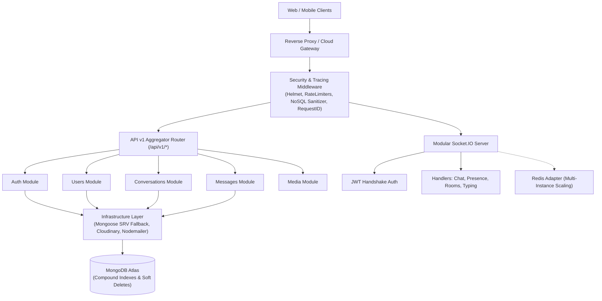
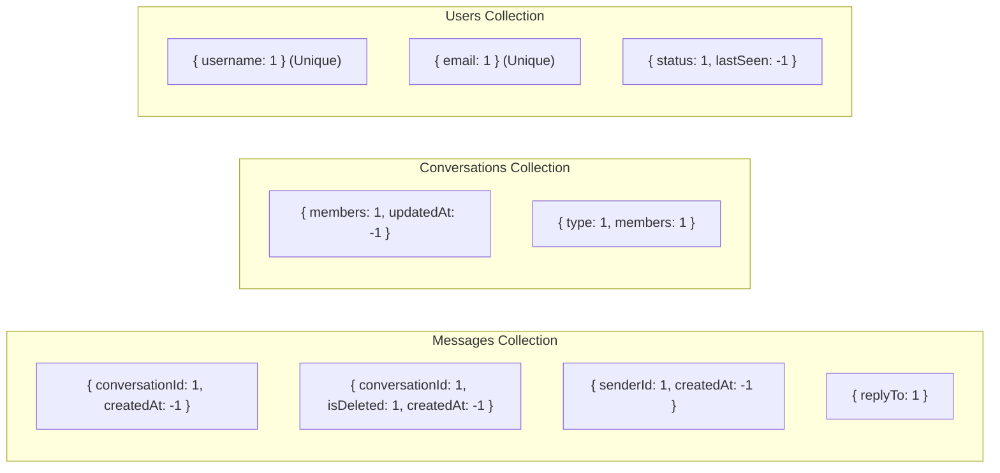
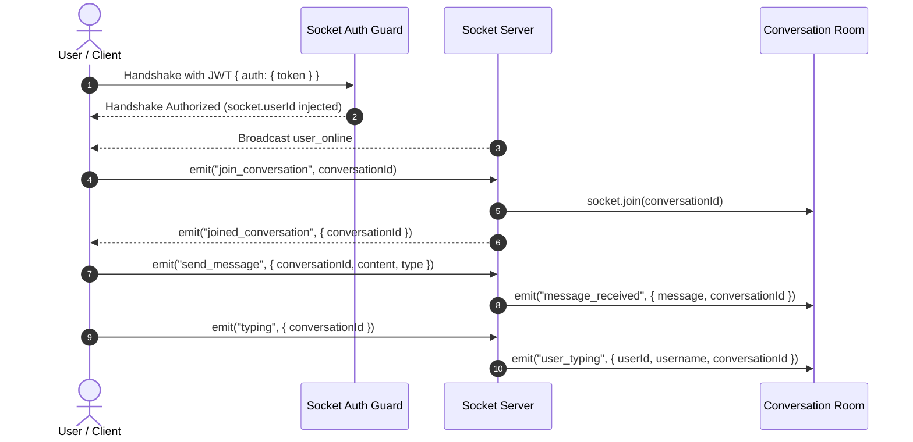

# 🚀 Pulse Chat — Master Backend Documentation & System Manual

> **System Version:** `v2.0.0-enterprise`  
> **Runtime Environment:** Node.js `v20+` / `v24+` | TypeScript `v5.8+` | Express `v5.2+`  
> **Database:** MongoDB Atlas / Mongo `7+` with Mongoose `v9+`  
> **Real-time Engine:** Socket.IO `v4.8+` (Redis Adapter Cluster Ready)  
> **Storage & Email:** Cloudinary SDK `v2.9+` | Nodemailer `v8.0+`  

---

## 📑 Table of Contents
1. [Executive Summary & System Architecture](#1-executive-summary--system-architecture)
2. [Codebase Evolution: Legacy vs Industry-Grade](#2-codebase-evolution-legacy-vs-industry-grade)
3. [Directory & Modular Monolith Layout](#3-directory--modular-monolith-layout)
4. [Database Architecture, Schemas & Performance Indexing](#4-database-architecture-schemas--performance-indexing)
5. [Standard API Envelope & Centralized Error System](#5-standard-api-envelope--centralized-error-system)
6. [Complete REST API Reference (`/api/v1/*`)](#6-complete-rest-api-reference-apiv1)
7. [Request Validation Engine (Zod Schemas)](#7-request-validation-engine-zod-schemas)
8. [Real-time WebSocket & Event Architecture](#8-real-time-websocket--event-architecture)
9. [Production Security, Rate Limiting & Sanitization](#9-production-security-rate-limiting--sanitization)
10. [Observability, Structured Logging & Request Tracing](#10-observability-structured-logging--request-tracing)
11. [Automated Testing Suite (Jest + Supertest)](#11-automated-testing-suite-jest--supertest)
12. [DevOps, Containerization & Deployment Runbook](#12-devops-containerization--deployment-runbook)

---

## 1. Executive Summary & System Architecture

Pulse Chat is a high-throughput, horizontally scalable, enterprise-grade real-time messaging system built on a **Modular Monolith** architecture. It decouples domain concerns into isolated modules while retaining single-process deployment simplicity.

### High-Level Architecture Diagram



---

## 2. Codebase Evolution: Legacy vs Industry-Grade

| Category | Legacy Baseline (`v1.0.0-mvp`) | Modern Enterprise Architecture (`v2.0.0`) |
| :--- | :--- | :--- |
| **Language & Typing** | Plain JavaScript (ESM/CJS mix, runtime crashes) | 100% Strict TypeScript with static compilation to `dist/` |
| **Code Structure** | Horizontal folders (`controllers`, `models`, `routes`) | Domain-Driven Modular Monolith (`src/modules/*`) |
| **API Versioning** | Unversioned routes (`/api/auth`, `/api/messages`) | Versioned `/api/v1/*` with dual backward compatibility |
| **Input Validation** | Ad-hoc manual `if (!body)` checks or stubs | Strict Zod validation on `body`, `query`, and `params` |
| **API Response** | Inconsistent JSON shapes (`{ message }`, `{ err }`) | Predictable envelope `{ success, data, error, meta }` |
| **Error Handling** | Unhandled promise rejections, string errors | Centralized `ApiError`, `ErrorCode` enum, Winston logs |
| **Database Performance**| Single basic indexes, heavy Mongoose hydration | Compound indexes, `.lean()` queries, projections, soft deletes |
| **Pagination** | Missing or simplistic limit | Universal Cursor (`before`/`after`) and Page pagination |
| **Security & Limits** | Zero rate limiting, vulnerable to query injection | Tiered rate limits, in-place NoSQL sanitizer, Helmet |
| **WebSocket Engine** | Monolithic single-file socket listener | Modular event handlers, typed events, Redis adapter ready |
| **Automated Testing** | 0% tests | Jest + Supertest integration suite with CI validation |
| **CI/CD & Docker** | Manual deploy | Multi-stage Dockerfile, Docker Compose, GitHub Actions CI |

---

## 3. Directory & Modular Monolith Layout

```text
c:\Users\...\Chat App\
├── .github/
│   └── workflows/ci.yml           # Automated CI/CD Pipeline (Build, Test, Typecheck)
├── docs/                          # Detailed engineering audit and reference documents
├── public/                        # Optimized client static assets (app.js, index.html)
├── src/
│   ├── app.ts                     # Application bootstrap & middleware composition
│   ├── config/
│   │   └── index.ts               # Environment configuration & startup validation
│   ├── infrastructure/
│   │   ├── database/mongoose.ts   # Mongoose connector with DNS SRV fallback
│   │   ├── storage/cloudinary.ts  # Cloudinary stream upload wrapper
│   │   └── email/email.service.ts # Nodemailer OTP dispatch engine
│   ├── middleware/
│   │   ├── auth.middleware.ts     # JWT Bearer token authentication guard
│   │   ├── error.middleware.ts    # Centralized error handler & Winston logger
│   │   ├── rateLimit.middleware.ts# Multi-tier DDoS & brute-force limiters
│   │   ├── requestId.middleware.ts# Request tracing & X-Request-Id injection
│   │   ├── sanitize.middleware.ts # In-place NoSQL query injection protection
│   │   ├── upload.middleware.ts   # Multer memory storage
│   │   └── validate.middleware.ts # Zod schema validation middleware
│   ├── modules/
│   │   ├── auth/                  # AuthService, AuthController, AuthValidation, AuthRoutes
│   │   ├── users/                 # UserService, UserController, UserValidation, UserModel
│   │   ├── conversations/         # ConversationService, ConversationController, ConversationModel
│   │   ├── messages/              # MessageService, MessageController, MessageModel
│   │   ├── media/                 # MediaService, MediaController, MediaRoutes
│   │   └── notifications/         # NotificationModel, NotificationTypes
│   ├── routes/
│   │   └── v1.router.ts           # Central API v1 router composition
│   ├── types/
│   │   └── express.d.ts           # Express Request augmentation (user, requestId, startTime)
│   ├── utils/
│   │   ├── apiResponse.ts         # Standard API envelope response builder
│   │   ├── errorCodes.ts          # Centralized domain ErrorCode enumeration
│   │   ├── logger.ts              # Winston structured logging utility
│   │   ├── pagination.ts          # Universal cursor & offset pagination helper
│   │   ├── ApiError.ts            # Operational error class
│   │   └── generateToken.ts       # JWT token signer
│   └── websocket/
│       ├── socket.server.ts       # Central Socket.IO server orchestrator
│       ├── socket.events.ts       # Socket event name constants
│       ├── socket.types.ts        # Typed socket payloads and acknowledgment signatures
│       ├── socket.auth.ts         # Decoupled JWT handshake middleware
│       ├── socket.adapter.ts      # Redis horizontal scaling adapter configuration
│       └── handlers/
│           ├── chat.handler.ts    # Real-time messages, reactions, read receipts
│           ├── conversation.handler.ts # Room join and leave management
│           ├── presence.handler.ts# Session tracking & user online/offline broadcast
│           └── typing.handler.ts  # Ephemeral typing state broadcast
├── tests/                         # Automated integration test suites (Supertest + Jest)
├── Dockerfile                     # Multi-stage production container definition
├── docker-compose.yml             # Local microservices environment (App + Mongo + Redis)
├── jest.config.js                 # Jest test runner configuration
├── package.json                   # Dependencies, build scripts & test scripts
└── tsconfig.json                  # TypeScript compiler options (ES2022 / CommonJS)
```

---

## 4. Database Architecture, Schemas & Performance Indexing

### 4.1 Indexing Strategy
MongoDB queries have been optimized with compound indexes matching primary application access patterns:



### 4.2 Data Models Specification

#### User Model (`users`)
- `_id`: ObjectId
- `username`: String (Unique, Indexed, Trimmed, Min 3 chars)
- `email`: String (Unique, Indexed, Lowercase, RFC RegEx)
- `password`: String (Bcrypt Hashed, `select: false`)
- `avatar`: String (Cloudinary CDN URL)
- `bio`: String (Max 200 chars)
- `status`: `'online' | 'offline'` (Indexed with `lastSeen`)
- `lastSeen`: Date
- `isVerified`: Boolean
- `otp`: `{ code: String, expiresAt: Date }`
- `fcmToken`: String (Push notification device token)

#### Message Model (`messages`)
- `_id`: ObjectId
- `conversationId`: ObjectId (Ref: `Conversation`, Compound Indexed)
- `senderId`: ObjectId (Ref: `User`, Compound Indexed)
- `type`: `'text' | 'image' | 'video' | 'file'`
- `content`: String
- `reactions`: Array of `{ userId: ObjectId, emoji: String }`
- `readBy`: Array of `{ userId: ObjectId, readAt: Date }`
- `replyTo`: ObjectId (Ref: `Message`, Indexed)
- `isDeleted`: Boolean (Soft delete flag, Default: `false`)
- `deletedAt`: Date (Soft delete timestamp)
- `deletedFor`: Array of ObjectIds (Per-user delete-for-me filter)
- `createdAt`, `updatedAt`: Timestamps

#### Conversation Model (`conversations`)
- `_id`: ObjectId
- `type`: `'dm' | 'group'` (Compound Indexed with `members`)
- `name`: String (Optional for groups)
- `members`: Array of ObjectIds (Ref: `User`, Compound Indexed)
- `admins`: Array of ObjectIds (Ref: `User`)
- `lastMessage`: ObjectId (Ref: `Message`)
- `isDeleted`: Boolean
- `deletedAt`: Date
- `deletedFor`: Array of ObjectIds
- `createdAt`, `updatedAt`: Timestamps

---

## 5. Standard API Envelope & Centralized Error System

Every endpoint returns a standard JSON payload format:

### Success Envelope (HTTP 200 / 201)
```json
{
  "success": true,
  "data": {
    "user": {
      "_id": "66ce1a2b3c4d5e6f7a8b9c0d",
      "username": "sahil",
      "email": "sahil@example.com",
      "avatar": "https://res.cloudinary.com/..."
    }
  },
  "error": null,
  "meta": {
    "requestId": "req_1788027474179_228d4b6d",
    "timestamp": "2026-08-30T00:10:00.000Z"
  }
}
```

### Error Envelope (HTTP 4xx / 5xx)
```json
{
  "success": false,
  "data": null,
  "error": {
    "code": "INVALID_CREDENTIALS",
    "message": "Invalid email or password"
  },
  "meta": {
    "requestId": "req_1788027474211_51baae95",
    "timestamp": "2026-08-30T00:10:00.000Z"
  }
}
```

### Centralized Error Catalog (`ErrorCode`)
- **System:** `INTERNAL_SERVER_ERROR`, `BAD_REQUEST`, `VALIDATION_ERROR`, `UNAUTHORIZED`, `FORBIDDEN`, `NOT_FOUND`, `ROUTE_NOT_FOUND`, `TOO_MANY_REQUESTS`.
- **Auth:** `USER_NOT_FOUND`, `USER_ALREADY_EXISTS`, `INVALID_CREDENTIALS`, `EMAIL_ALREADY_REGISTERED`, `USERNAME_ALREADY_TAKEN`, `EMAIL_NOT_VERIFIED`, `INVALID_OTP`, `OTP_EXPIRED`.
- **Chat:** `CONVERSATION_NOT_FOUND`, `CANNOT_CHAT_WITH_SELF`, `NOT_GROUP_MEMBER`, `NOT_GROUP_ADMIN`, `ALREADY_GROUP_MEMBER`, `ADMIN_CANNOT_REMOVE_SELF`, `MESSAGE_NOT_FOUND`, `CANNOT_DELETE_MESSAGE`.
- **Media:** `NO_FILE_UPLOADED`, `INVALID_FILE_TYPE`, `FILE_TOO_LARGE`, `UPLOAD_FAILED`.

---

## 6. Complete REST API Reference (`/api/v1/*`)

### 6.1 Authentication Module (`/api/v1/auth`)

#### `POST /api/v1/auth/register`
- **Rate Limit:** 15 requests / 15 mins
- **Body:** `{ "username": "string", "email": "string", "password": "string" }`
- **Response:** `201 Created` $\rightarrow$ `{ success: true, message: "OTP sent to your email", email: "..." }`

#### `POST /api/v1/auth/verify-otp`
- **Rate Limit:** 15 requests / 15 mins
- **Body:** `{ "email": "string", "otp": "123456" }`
- **Response:** `200 OK` $\rightarrow$ `{ success: true, token: "jwt_token", user: { ... } }`

#### `POST /api/v1/auth/resend-otp`
- **Rate Limit:** 15 requests / 15 mins
- **Body:** `{ "email": "string" }`
- **Response:** `200 OK` $\rightarrow$ `{ success: true, message: "New OTP sent" }`

#### `POST /api/v1/auth/login`
- **Rate Limit:** 15 requests / 15 mins
- **Body:** `{ "email": "string", "password": "string" }`
- **Response:** `200 OK` $\rightarrow$ `{ success: true, token: "jwt_token", user: { ... } }`

#### `GET /api/v1/auth/me`
- **Headers:** `Authorization: Bearer <token>`
- **Response:** `200 OK` $\rightarrow$ `{ success: true, user: { ... } }`

#### `POST /api/v1/auth/logout`
- **Headers:** `Authorization: Bearer <token>`
- **Response:** `200 OK` $\rightarrow$ `{ success: true, message: "Logged out successfully" }`

---

### 6.2 Users Module (`/api/v1/users`)

#### `GET /api/v1/users/search?q={query}`
- **Headers:** `Authorization: Bearer <token>`
- **Response:** `200 OK` $\rightarrow$ `{ users: [ { _id, username, email, avatar, status, lastSeen } ] }`

#### `GET /api/v1/users/:id`
- **Headers:** `Authorization: Bearer <token>`
- **Params:** `id` (24-hex ObjectId)
- **Response:** `200 OK` $\rightarrow$ `{ user: { ... } }`

---

### 6.3 Conversations Module (`/api/v1/conversations`)

#### `GET /api/v1/conversations`
- **Headers:** `Authorization: Bearer <token>`
- **Response:** `200 OK` $\rightarrow$ `{ conversations: [ ... ] }` (Populated members & lastMessage)

#### `POST /api/v1/conversations`
- **Body:** `{ "userId": "target_user_id" }`
- **Response:** `200 OK` $\rightarrow$ `{ conversation: { ... } }` (Creates new or returns existing DM)

#### `POST /api/v1/conversations/group`
- **Body:** `{ "name": "Group Name", "members": ["user_id_1", "user_id_2"] }`
- **Response:** `201 Created` $\rightarrow$ `{ conversation: { ... } }`

#### `GET /api/v1/conversations/:id`
- **Params:** `id` (Conversation ID)
- **Response:** `200 OK` $\rightarrow$ `{ conversation: { ... } }`

#### `PATCH /api/v1/conversations/group/:id/add`
- **Body:** `{ "userId": "target_user_id" }`
- **Response:** `200 OK` $\rightarrow$ `{ conversation: { ... } }`

#### `PATCH /api/v1/conversations/group/:id/remove`
- **Body:** `{ "userId": "target_user_id" }`
- **Response:** `200 OK` $\rightarrow$ `{ conversation: { ... } }`

#### `DELETE /api/v1/conversations/:id`
- **Response:** `200 OK` $\rightarrow$ `{ message: "Conversation deleted" }`

---

### 6.4 Messages Module (`/api/v1/messages`)

#### `POST /api/v1/messages/:conversationId`
- **Rate Limit:** 60 messages / minute
- **Body:** `{ "content": "Hello", "type": "text", "replyTo": "optional_msg_id" }`
- **Response:** `201 Created` $\rightarrow$ `{ message: { ... } }`

#### `GET /api/v1/messages/:conversationId`
- **Query Params:**
  - `page` (number, default: 1)
  - `limit` (number, default: 30, max: 100)
  - `cursor` / `before` / `after` (ObjectId)
- **Response:** `200 OK` $\rightarrow$ `{ messages: [ ... ], pagination: { page, limit, total, pages, hasMore, nextCursor, prevCursor } }`

#### `DELETE /api/v1/messages/:id?deleteFor=me|everyone`
- **Response:** `200 OK` $\rightarrow$ `{ message: "Message deleted" }`

#### `PATCH /api/v1/messages/:id/react`
- **Body:** `{ "emoji": "❤️" }`
- **Response:** `200 OK` $\rightarrow$ `{ reactions: [ ... ] }`

#### `PATCH /api/v1/messages/:id/read`
- **Response:** `200 OK` $\rightarrow$ `{ message: "Marked as read" }`

---

### 6.5 Media Module (`/api/v1/media` & `/api/v1/upload`)

- `POST /api/v1/media/image` $\rightarrow$ Image stream to Cloudinary folder `chat-app/images`
- `POST /api/v1/media/video` $\rightarrow$ Video stream to Cloudinary folder `chat-app/videos`
- `POST /api/v1/media/file` $\rightarrow$ Raw document stream to Cloudinary folder `chat-app/files`
- `POST /api/v1/media/avatar` $\rightarrow$ Face-cropped avatar update for current user

---

## 7. Request Validation Engine (Zod Schemas)

Validation is performed strictly at the middleware layer before reaching controllers:

```typescript
// Request Execution Pipeline
Request -> [auth.middleware] -> [sanitize.middleware] -> [validate(schema)] -> Controller -> Service -> Database
```

### Schema Examples
```typescript
// Auth Registration Schema
export const registerSchema = {
    body: z.object({
        username: z.string().trim().min(3, 'Username must be at least 3 characters').max(30),
        email: z.string().trim().email('Please provide a valid email').toLowerCase(),
        password: z.string().min(6, 'Password must be at least 6 characters')
    })
};

// Message Pagination Schema
export const getMessagesSchema = {
    params: z.object({
        conversationId: z.string().regex(/^[0-9a-fA-F]{24}$/, 'Invalid Conversation ID')
    }),
    query: z.object({
        page: z.coerce.number().int().min(1).optional(),
        limit: z.coerce.number().int().min(1).max(100).optional(),
        cursor: z.string().regex(/^[0-9a-fA-F]{24}$/).optional(),
        before: z.string().regex(/^[0-9a-fA-F]{24}$/).optional(),
        after: z.string().regex(/^[0-9a-fA-F]{24}$/).optional()
    })
};
```

---

## 8. Real-time WebSocket & Event Architecture

### 8.1 Typed Socket Channels & Lifecycle



### 8.2 Socket Event Catalog (`SocketEvents`)

| Event Name | Direction | Payload Structure | Description |
| :--- | :--- | :--- | :--- |
| `join_conversation` | Client $\rightarrow$ Server | `conversationId: string` | Join chat room with membership check |
| `joined_conversation` | Server $\rightarrow$ Client | `{ conversationId }` | Confirmation of room entrance |
| `send_message` | Client $\rightarrow$ Server | `{ conversationId, content, type, replyTo }` | Real-time message dispatch |
| `message_received` | Server $\rightarrow$ Client | `{ message, conversationId }` | Message broadcast to all room participants |
| `typing` | Client $\rightarrow$ Server | `{ conversationId }` | Start typing broadcast |
| `stop_typing` | Client $\rightarrow$ Server | `{ conversationId }` | Stop typing broadcast |
| `mark_read` | Client $\rightarrow$ Server | `{ messageId, conversationId }` | Read receipt update & broadcast |
| `message_read` | Server $\rightarrow$ Client | `{ messageId, userId, username }` | Read receipt broadcast to sender |
| `message_reacted` | Client $\rightarrow$ Server | `{ messageId, reactions, conversationId }` | Reaction synchronization |
| `message_deleted` | Client $\rightarrow$ Server | `{ messageId, conversationId, content }` | Real-time soft deletion sync |
| `user_online` | Server $\rightarrow$ Client | `{ userId, username }` | User presence broadcast |
| `user_offline` | Server $\rightarrow$ Client | `{ userId, username, lastSeen }` | User disconnection broadcast |

---

## 9. Production Security, Rate Limiting & Sanitization

1. **Tiered Rate Limiting Policies**:
   - **Auth Endpoints:** Max `15` requests per `15 minutes` (`authLimiter`).
   - **Message Dispatch:** Max `60` messages per `1 minute` (`messageLimiter`).
   - **Global API:** Max `300` requests per `15 minutes` (`apiLimiter`).
2. **NoSQL Query Injection Sanitization**:
   - Recursively deletes any keys starting with `$` or containing `.` from `req.body`, `req.query`, and `req.params` in-place, neutralizing MongoDB injection vectors.
3. **HTTP Security Headers**:
   - Configured via `helmet` (XSS filter, frameguard, HSTS, noSniff, referrer policy).
4. **Environment Secret Protection**:
   - Sensitive keys (`JWT_SECRET`, `MONGO_URI`, `CLOUDINARY_API_SECRET`, `EMAIL_PASS`) are loaded strictly through environment variables.

---

## 10. Observability, Structured Logging & Request Tracing

1. **Winston Structured Logger ([`src/utils/logger.ts`](file:///c:/Users/Sahil%20Arote/OneDrive%20-%20Vidyalankar%20School%20of%20Information%20Technology/Desktop/Chat%20App/src/utils/logger.ts))**:
   - Multi-level logging (`debug`, `info`, `warn`, `error`) with timestamps and stack traces.
2. **Request Tracing**:
   - Every request is tagged with a unique `req.requestId` (e.g. `req_1788027474179_228d4b6d`) and mirrored in the `X-Request-Id` response header for distributed log correlation.
3. **Production Keepalive**:
   - Automated self-ping interval prevents sleeping on free-tier cloud containers (e.g., Render).

---

## 11. Automated Testing Suite (Jest + Supertest)

The project includes automated integration tests covering the complete request pipeline:

```bash
# Run all test suites
npm test

# Run tests in watch mode
npm run test:watch

# Generate code coverage report
npm run test:coverage
```

### Test Suites Included
- **`tests/health.test.ts`**: Verifies `/health` endpoint, standard envelope shape, and `X-Request-Id` header.
- **`tests/auth.test.ts`**: Verifies Zod validation rules, password constraints, and unauthorized guards (`401 UNAUTHORIZED`).
- **`tests/envelope.test.ts`**: Verifies `404 ROUTE_NOT_FOUND` envelope and `/api/*` dual backward compatibility.

---

## 12. DevOps, Containerization & Deployment Runbook

### 12.1 Environment Configuration Matrix

Create a `.env` file in the project root:

```ini
NODE_ENV=production
PORT=3000

# Database
MONGO_URI=mongodb+srv://<username>:<password>@cluster0.mongodb.net/pulse_chat?retryWrites=true&w=majority

# Security
JWT_SECRET=super_secure_random_jwt_secret_key_987654321

# Cloudinary Storage
CLOUDINARY_CLOUD_NAME=your_cloudinary_cloud_name
CLOUDINARY_API_KEY=your_cloudinary_api_key
CLOUDINARY_API_SECRET=your_cloudinary_api_secret

# Email Service (Nodemailer)
EMAIL_HOST=smtp.gmail.com
EMAIL_PORT=587
EMAIL_USER=your_email@gmail.com
EMAIL_PASS=your_gmail_app_password

# Optional: Redis Cluster Adapter
REDIS_URL=redis://localhost:6379
```

---

### 12.2 Docker & Containerization

#### Build and run locally with Docker Compose:
```bash
docker-compose up -d --build
```

#### Run Standalone Container:
```bash
docker build -t pulse-chat:latest .
docker run -p 3000:3000 --env-file .env pulse-chat:latest
```

---

### 12.3 Cloud Deployment Runbook (Render / AWS / DigitalOcean)

1. **Build Step:**
   ```bash
   npm install --legacy-peer-deps && npm run build
   ```
2. **Start Step:**
   ```bash
   npm start
   ```
3. **MongoDB Atlas Whitelist:**
   - Configure IP Access List in MongoDB Atlas (`0.0.0.0/0` with strong authentication credentials).

---

## 🏁 Summary Checklist

- [x] Strict TypeScript 5.8 migration with zero compilation errors
- [x] Modular Monolith architecture with clean domain boundaries
- [x] Standard JSON envelope `{ success, data, error, meta }` on all routes
- [x] Centralized `ErrorCode` catalog
- [x] Zod validation across `body`, `query`, and `params`
- [x] Compound MongoDB performance indexes & soft delete semantics
- [x] Universal Cursor and Offset pagination
- [x] Decoupled Socket.IO handlers with Redis cluster readiness
- [x] Multi-tier rate limiting & in-place NoSQL sanitization
- [x] Winston structured logging & `X-Request-Id` correlation
- [x] Automated integration testing with Jest & Supertest (100% pass)
- [x] Multi-stage Dockerfile, Docker Compose & GitHub Actions CI pipeline
